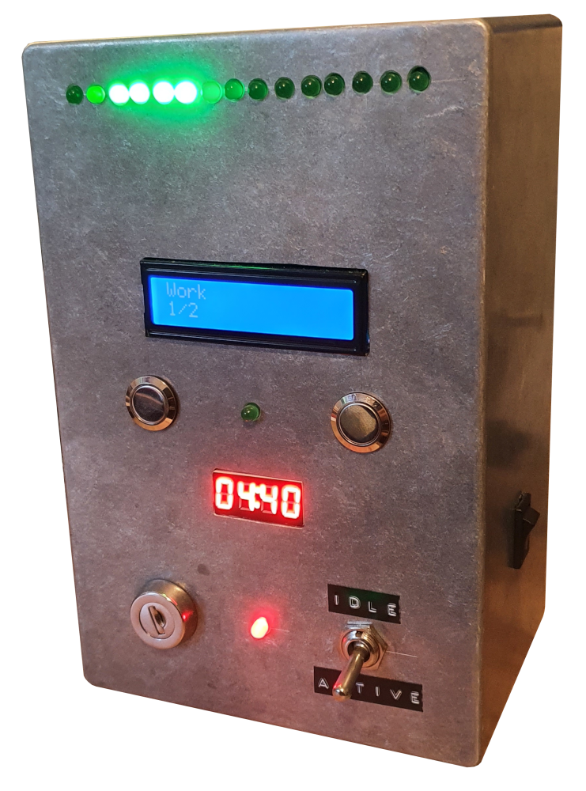

# procStop
Stop procrastinating now!

ProcStop is a hardware checklist tool, you can use to keep track of your tasks and force you to do them.
The idea came from a [youtube video](https://youtu.be/JJeQIXBdVuk) by Mike Boyd.
ProcStop tries to expand on that idea by letting you define any number of tasks and also ensuring that you do them for as long as you planned.
Also you'll get statistics to analyze your progress.
ProcStop consists of a web interface and a client software.
It is designed to run on a *Raspberry Pi* and currently only tested on *Raspberry Pi 2 B* with *Raspbian*, but could possibly run on any device with enough GPIO Pins.

## ProcStop Web
The [Web interface](web/) is used to add tasks for a day and for viewing the statistics.

## ProcStop client
The [client](procStop-client) handles the hardware described in the [circuit diagram](resources/circuit.svg).
This is where you check off your tasks.
