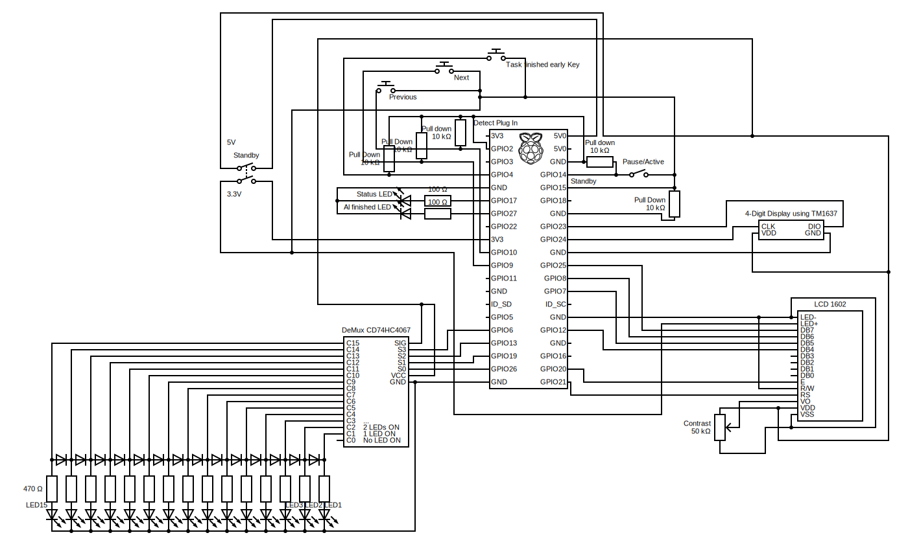
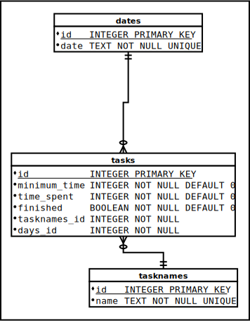

# procStop
Stop procrastinating now!

ProcStop is a hardware checklist tool, you can use to keep track of your tasks for the current day.
The idea came from a [youtube video](https://youtu.be/JJeQIXBdVuk) by Mike Boyd.
ProcStop tries to expand on that idea by letting you define any number of tasks and also ensuring that you do them for as long as you planned.
Also you'll get statistics to analyze your progress.
ProcStop consists of a web interface and a client software.
It is designed to run on a *Raspberry Pi* and currently only tested on *Raspberry Pi 2 B* with *Raspbian*, but could possibly run on any device with enough GPIO Pins.

## Operation
- First add the tasks you have to do for any day into the database using the web interface
- After that turn on the device with the power switch on it's side

- You can switch through your tasks for the current day using the left and right buttons
- When you are working on a task, flip the switch on the front to *active*, the time will go down and the progress bar on top will fill up as you are doing the task
- When you are done with a task or need a break, flip the switch on the front to *idle*
- When you are done with all the tasks, flip the switch to idle and a little animation will start playing to congratulate you
- If you are done earlier than anticipated with a task you can use a key to mark the task as done

## ProcStop Web
The [Web interface](web/) is used to add or delete tasks for any day you want and for viewing the statistics.

## ProcStop client
The [client](procStop-client) is used to operate the hardware described in the [hardware section](#hardware).

## Hardware
To build the hardware refer to the hardware diagram below, as well as the [Hardware list](#hardware-list).

### Hardware List
- 1x Raspberry Pi
- 16x green LEDs (Progress bar, finished LED)
- 1x red LED (Active LED)
- 1x simple Switch (Idle/active switch)
- 1x DPST two Pole Switch (Standby switch)
- 2x Buttons (Next/Previous Task)
- 1x Key-activated "button" (for finishing a task early)
- 15x 470Ω resistors (Progress bar leds)
- 2x 100Ω resistors (for status and finished LEDs)
- 5x 10kΩ resistors ([Pull down resistors](https://en.wikipedia.org/wiki/Pull-up_resistor))
- 1x 50kΩ Potentiometer resistor (for changing contrast of 1602 display)
- 14x diodes (with as little a voltage drop as possible, for status bar)
- 1x CD74HC4067 De-Multiplexer (for decreasing amount of gpio pins required by progress bar)
- 1x TM1637 4-digit 7-segment Display (for displaying time left on current task)
- 1x LCD 1602 Display (for displaying current tasks name and amount of total tasks)
- 1x Raspberry Pi GPIO breakout board (for easier construction)
- Enough wires to connect it all

For housing you may use any container, that is large enough to fit the Raspberry-Pi and the other electronics.
I first prototyped it inside a cardboard box.

## Internals (for developers)
The documentation below is not relevant for using the software as it is, but for anyone who may want to improve or change it.

